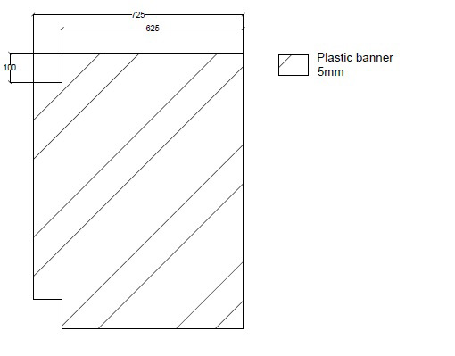
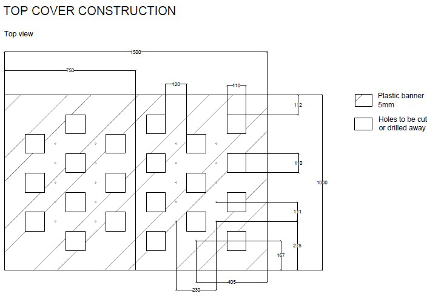

# STEP BY STEP GUIDE

## INTRODUCTION

This hydroponic system was developed as a custom design feature for Bitcoin Coffee in Parallel Polis. It is meant to supply the Cafe with specific vegetables that are being used there (mostly leaf vegetables). It also serves for experiments that are combining growing in hydroponic system, IoT technologies, and open source in order to reach as much autonomity of the system as possible that is able to optimize growing process, and energy consumption to the most reasonable effectivity.

## TOOLS

* Drilling machine
* Screw driver
* Glue gun (depending of the type of the glue)
* Paint brush (10cm or wider)
* NT cutter
* Personal protection equipment

## RESERVOIR CONSTRUCTION

### LIST OF MATERIALS:

* Plywood board 96x20x2cm	2PCS
* Plywood board 150x20x2cm 	2PCS
* Screws for wood 4x40 		12PCS
* Plastic board (used plastic banner) 150x100x0,5cm	1PC
* Screws for the wood 3x40	46PCS
* Plastic board (used plastic banner) 146x96x0,5cm 	1PC
* Plastic board (used plastic banner) 146x18x0,5cm 	2PCS
* Plastic board (used plastic banner) 95x18x0,5cm 	2PCS
* Glue for plastics		0,5L
* Plumbers putty			280ml

### PROCEDURE:

#### Step 1	
Construct the basic frame of the box out of the plywood. Fix each side evenly with 3 screws 4x40. To avoid rupture of the plywood it is recommended to drill a hole of slightly smaller diameter than the diameter of the screw. When completed, dril a hole for pump cable in the upper half of the box height (as per drawing).

#### Step 2	
Attach the plastic board  (150x100cm) to the wooden frame to create first layer of the bottom. Use glue and screws 3x40. Screws shall be placed in 10cm distance from each other.

#### Step 3	
Glue another plastic board (146x96cm) on the top of the bottom plastic board to create second layer of the bottom. Blank side should face up.

#### Step 4	
Glue plastic boards (146x18x0,5cm and 95x18x0,5cm) on sides of the box from the inside.

#### Step 5	
Seal all gaps with plumbers putty to seal the reservoir. Repeat this operation couple of times to make sure the reservoir will be waterproof. TIP: Once this step is done conduct a leakage test by filling the reservoir with water to the level of 11cm of depth and look for any leakage.

#### REFERENCE	 
Refer to the drawing Reservoir for more information.

## MIDDLE FLOOR

### LIST OF MATERIALS:

* Plastic board (used plastic banner) 95x72,5x0,5cm		 2PCS
* Plastic anchors for styrofoam heat insulation Length 6cm 	21PCS
* Plumbers putty		280ml

### PROCEDURE:

#### Step 1	
Take one plastic board and cut away two corners. Corners are being cut away to create passage for the irrigation pipeline, and to create access to the growing solution for monitoring.

#### Step 2	
Cut plastic anchors to the length of 6cm and glue them to both boards with plumbers putty.

#### REFERENCE	
Refer to the drawing Middle Floor Construction for more information.

## TOP BOARD

### LIST OF MATERIALS:

* Plastic board (used plastic banner) 75x100x0,5cm 		2PCS
* Plastic board (used plastic banner) 72,5x95x0,5cm 		2PCS
* Glue for plastics
* Plastic anchors for styrofoam heat insulation Length 12,5cm 	10PCS
* Plumbers putty

### PROCEDURE:

#### Step 1	
Glue smaller plastic boards to the bottom of larger ones. One edge should be aligned with the larger board while leaving even 2,5cm gap on other three sides.

#### Step 2	
Cut away holes for pots and irrigation capillary pipes. 

#### Step 3	
Cut plastic anchors to the length of 12,5cm and glue them with plumbers putty or super glue to the bottom of both plastic boards.

#### REFERENCE	
Refer to the drawing Top Board Construction for more information.

## IRRIGATION

### LIST OF MATERIALS:

•	Plastic pipe diameter 1,5cm holder 		14PCS
•	Plastic pipe diameter 1,5cm			6m
•	Plastic pipe L connection diameter 1,5cm 	8PCS
•	Plastic pipe T connections diameter 1,5cm 	3PCS
•	Plastic hose diameter 1,5cm 			1m
•	Plastic hose L connections 			2PCS
•	Plastic flow regulator				22PCS
•	Plastic capillary pipes 30cm 			21PCS
•	Dripping needles 				21PCS
•	Super glue 					1PC
•	Submersible water pump 750l/h		1PC
•	Lever cable connectors 				2PCS

### PROCEDURE:

#### Step 1	
Glue plastic pipe holders to the bottom of the board (7pcs per board) with super glue.

hello world
* gggg
* ggg
* ggg

#

zh
1. list 1
2. dfdfd
2. fdfdfd
3. gggg
4. gggg

### 444
## ff
###### ssss
