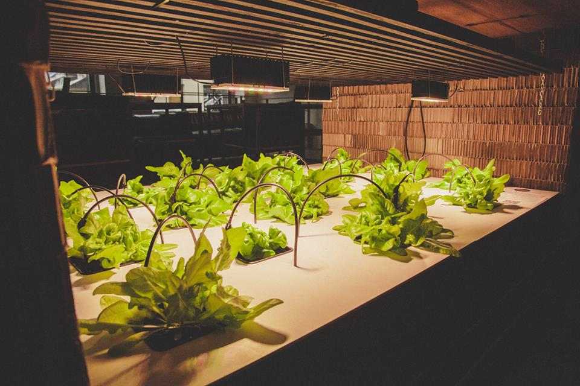

# Hydroponics-in-a-box

## EXPERIMENTAL DESIGN FEATURE TO GROW PLANTS IN A CAFE

### PURPOSE

This hydroponics box was custom developed to fit under the bar in Bitcoin Coffee at Paralelní Polis in Prague. This hydroponic box uses the drip irrigation principle. It serves as special design feature where vegetables can be grown for the purpose of the cafe, to study production process, to communicate the technology with the public, and to conduct workshops on growing in hydroponics. Thebox was designed in a way to be as compact as possible in order to avoid external solution reservoir, exposed wiring, etc. This project consists of two projects that form a compatible outcome product: hydroponics system itself, and IoT device that is being developed in order to collect data about the growing process, optimize costs, and eventually to take control over the system.

### OPEN SOURCE REPOSITORIES

#### Hydroponics system

Full documentation about this project may be found in the Github repository under following link: [https://github.com/ParallelGarden/Hydroponics-in-a-box](https://github.com/ParallelGarden/Hydroponics-in-a-box)

##### Development road map:

* Lights - We are overall interested in finding the perfect fit lights for our system to ipmrove the efe

##### IoT device

[https://github.com/octopusengine/octopusLAB_parallel_garden](https://github.com/octopusengine/octopusLAB_parallel_garden)
